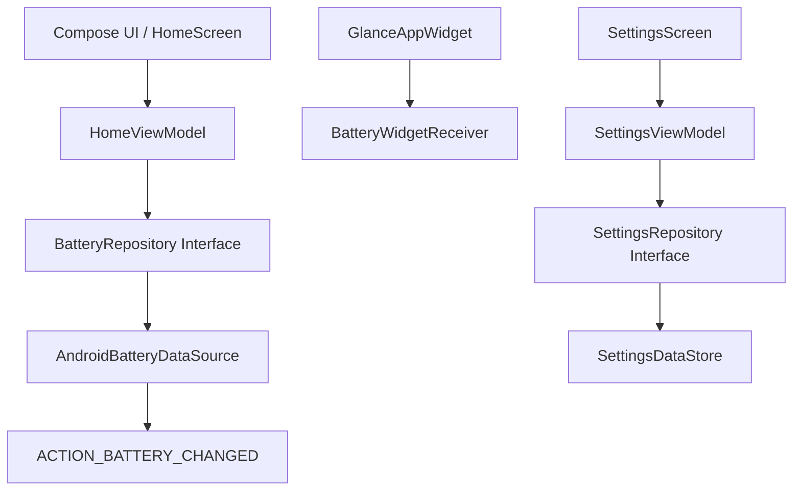

# Battery Gyan


*A professional, open-source Android battery visibility and accessibility utility.*

---

## What is Battery Gyan?
Battery Gyan is a lightweight, offline-first Android utility that makes battery level highly readable for users who struggle to see the small system battery percentage. Whether you need larger typography, high contrast, or a simple glanceable home-screen widget, Battery Gyan provides maximum readability with minimum battery/resource cost.

## Why Battery Gyan?
The default Android status bar battery percentage is often too small for comfortable viewing, especially for glasses users, older users, and anyone who prefers highly visible UI. Battery Gyan solves this problem without adding bloated features, ads, or background trackers. It respects your privacy and your device's battery life.

## Key Features

| Feature | Description |
|---|---|
| 🔍 **Large & Clear UI** | Easily read your battery percentage and charging state inside the app with scalable typography. |
| 🪟 **Responsive Widgets** | Highly configurable home-screen widgets via Jetpack Glance that adapt to small, medium, and large sizes. |
| 🎨 **Material 3 Theming** | Modern, premium, minimalist UI with Light, Dark, and System theme support. |
| 📴 **Offline-First Privacy** | No internet permission, no accounts, no analytics, and no ads. Local preferences are stored safely on-device via DataStore. |
| ⚡ **Battery Efficient** | Event-driven updates using standard Android broadcast intents (`ACTION_POWER_CONNECTED`, etc.). No continuous background polling. |

## Accessibility
Battery Gyan is built accessibility-first:
* User-adjustable text scaling (0.8x to 2.0x).
* Clear, non-color-reliant status labels.
* Strong visual hierarchy and contrast.
* Supports TalkBack semantics.

## Performance & Battery Efficiency
We care about your battery life. Battery Gyan is designed to consume negligible resources:
* **No continuous polling:** The app and widgets only update when necessary (e.g., when you open the app, tap a widget, or plug in your device).
* **No unnecessary background services:** We do not run persistent background loops or WorkManager jobs.
* **Minimal dependencies:** Clean native architecture to keep the APK size incredibly small.

## Tech Stack
* **Language:** Kotlin
* **UI Framework:** Jetpack Compose (Material 3)
* **Widget Framework:** Jetpack Glance
* **Architecture:** MVVM (Model-View-ViewModel)
* **Persistence:** Jetpack DataStore (Preferences)
* **Concurrency:** Kotlin Coroutines & Flows
* **Build System:** Gradle (Kotlin DSL, Version Catalog)

## Architecture



## Project Structure
```text
app/src/main/java/com/crdy/batterygyan/
├── MainActivity.kt            # Entry point and Compose Navigation setup
├── data/                      # Repositories and DataStore implementation
├── domain/                    # Enums, Data Classes, and core models
├── platform/                  # Android-specific battery broadcast receivers
├── ui/                        # Jetpack Compose UI screens (Home & Settings)
├── ui/theme/                  # Material 3 typography, colors, and themes
└── widget/                    # Jetpack Glance widget layout and receivers
```

## Installation & Development
Requirements:
- Android Studio / JDK 17
- Minimum SDK: 29 (Android 10)
- Target SDK: 34

To build locally:
```bash
# Clone the repository
git clone https://github.com/ritikthakur22/battery-info_app.git

# Run lint checks
./gradlew lint

# Build debug APK
./gradlew assembleDebug
```

## Privacy
Battery Gyan requires absolutely **zero dangerous permissions**. It does not have the `INTERNET` permission in its manifest. Your settings stay on your device.

## License
This project is licensed under the **GNU General Public License v3.0 (GPL-3.0)**. See the [LICENSE](LICENSE) file for details.
