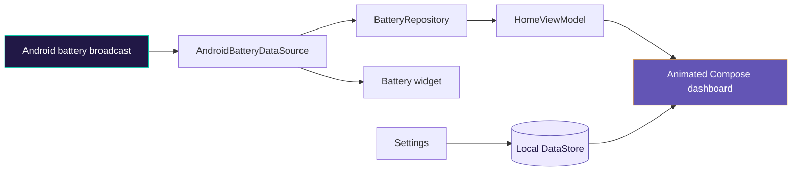
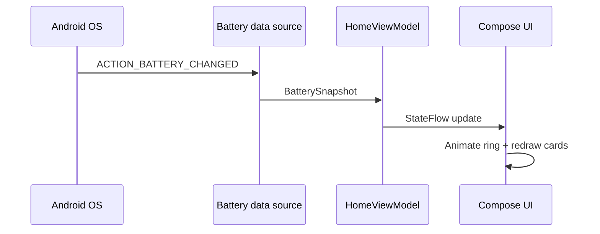

<div align="center">


<p><strong>A beautiful, readable, offline-first battery dashboard for Android.</strong></p>


<br /><br />


</div>

## ✨ The quick story

Android’s default battery indicator is tiny and shallow. Battery Gyan turns it into a friendly, glanceable dashboard with oversized type, a lively progress ring, charging guidance, and the details power users actually want.

<table>
<tr><td>⚡ <b>Live telemetry</b><br/>Level, state, plug type, temperature, voltage, current, energy, health and technology.</td><td>🎨 <b>Expressive UI</b><br/>Animated charging pulse, semantic color states, Material 3 surfaces and adaptive iconography.</td></tr>
<tr><td>♿ <b>Accessibility first</b><br/>Adjustable 0.8×–2× type scale, clear labels, strong hierarchy and TalkBack-friendly content.</td><td>🛡️ <b>Private by default</b><br/>No account, ads, analytics, network access or background polling. Ever.</td></tr>
</table>

## 🧭 How it works



The app is deliberately event-driven: the foreground flow registers only while the screen is observed, and the widget reads the platform battery manager when it renders. That means no service, wake lock, timer, or cloud account is needed.

## 🎬 UI motion, without motion sickness

| Moment | Motion | Meaning |
|---|---|---|
| Battery value changes | Ring eases to the new percentage | The reading is fresh |
| Device is charging | Accent ring breathes gently | Power is flowing |
| Low battery | Accent shifts to warm amber | A clear, non-verbal cue |
| Screen opens | Progress indicator resolves | Data is being read |

## 🧱 Architecture



## 🛠️ Build it

Requires Android Studio with JDK 17 and Android SDK 34.

```bash
git clone https://github.com/ritikthakur22/battery-info_app.git
cd battery-info_app
./gradlew assembleDebug
./gradlew lint
```

Release signing is intentionally local/secret-only. Put values in an ignored `keystore.properties` file when you need a signed build; the repository contains no signing credentials.

## 📦 Project map

```text
app/src/main/java/com/crdy/batterygyan/
├── data/       repositories + local DataStore
├── domain/     battery and display models
├── platform/   Android battery event adapter
├── ui/         animated Compose home + settings
└── widget/     responsive Jetpack Glance widget
```

## 🔐 Privacy & license

Battery Gyan requests zero permissions and has no `INTERNET` declaration. Battery readings never leave the device. The project is available under [GPL-3.0](LICENSE).

<div align="center">
<br />

</div>
