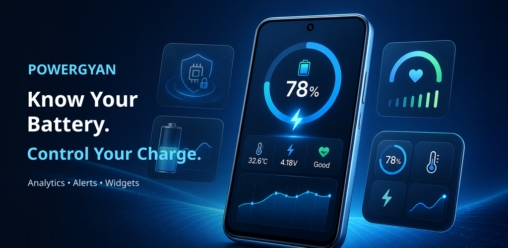
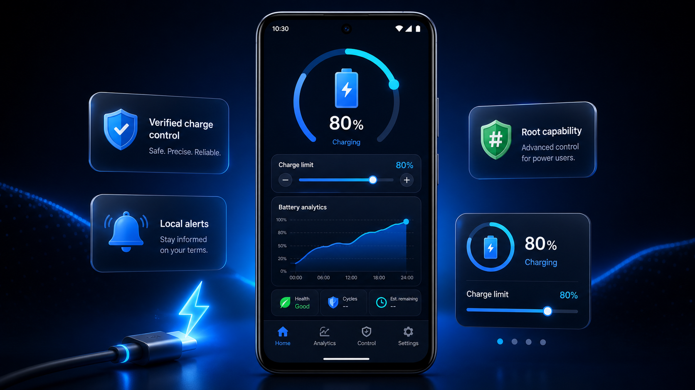
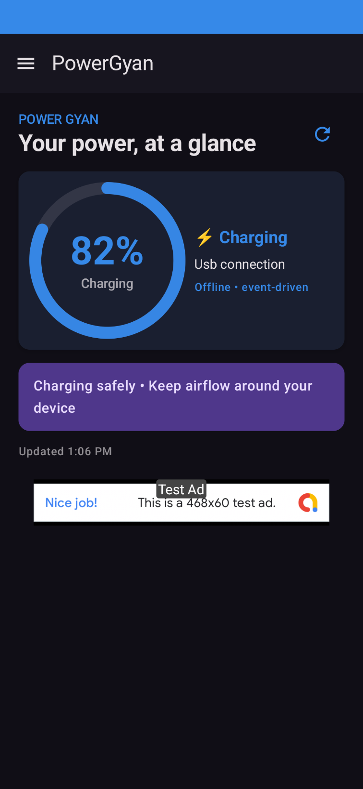
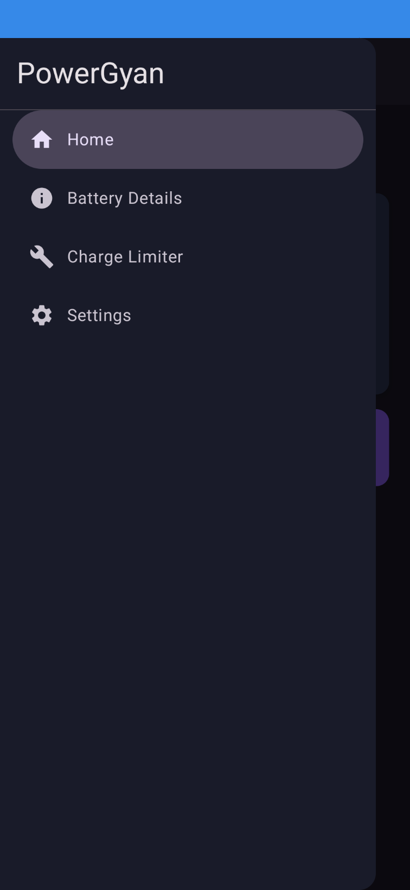
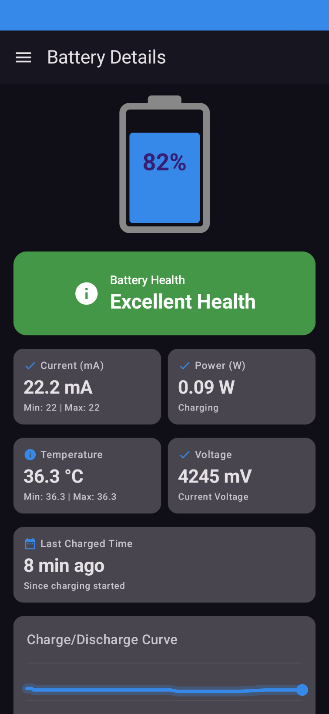
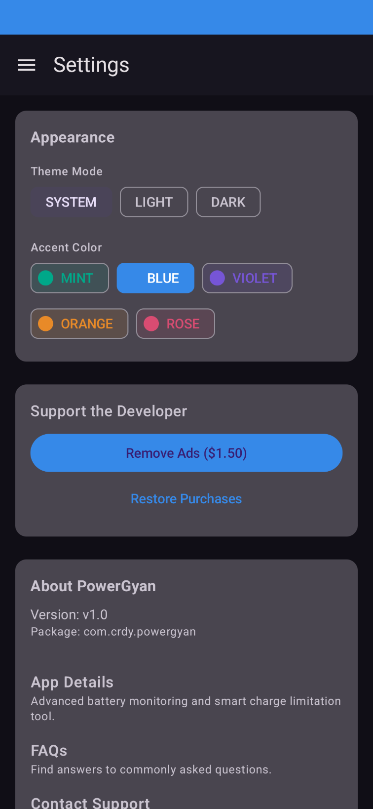
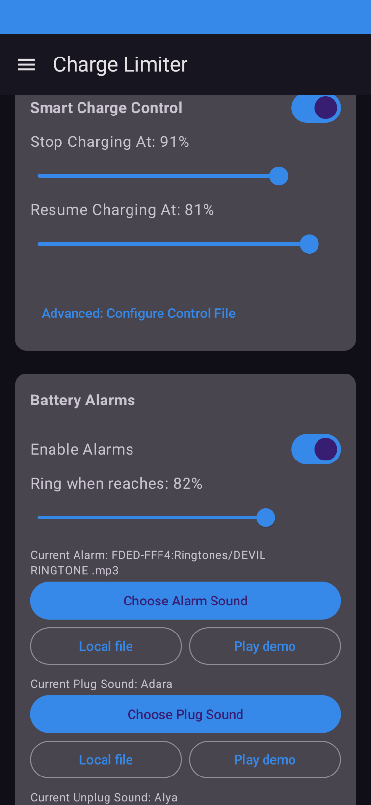

<div align="center">



<p><strong>PowerGyan - Charge Limiter &amp; Battery Analytics [Root]</strong></p>


<br /><br />


</div>

PowerGyan is an Android battery dashboard for users who want clear battery information, local alerts, widgets, and optional capability-based charge control. Standard battery information works without Root, Shizuku, or Internet access.

## App preview

This is the interface included in the `v1.0.2` APK. The generated feature image summarizes the product direction; the screenshots are captured from the running app.

Play Console icon: [powergyan-app-icon.png](docs/images/powergyan-app-icon.png) — 512×512 PNG exported from the active adaptive launcher icon design.

Play Console feature graphic: [powergyan-feature-graphic.png](docs/images/powergyan-feature-graphic.png) — 1024×500 RGB PNG.

<div align="center">

</div>

<table>
<tr>
<td align="center"><br /><sub>Home dashboard</sub></td>
<td align="center"><br /><sub>Navigation drawer</sub></td>
<td align="center"><br /><sub>Battery details</sub></td>
</tr>
<tr>
<td align="center"><br /><sub>Appearance settings</sub></td>
<td align="center"><br /><sub>Charge limiter and alarms</sub></td>
<td align="center">⚡<br /><sub>Root and non-root capability paths</sub></td>
</tr>
</table>

## Features

- Large battery percentage with charging and low-battery states.
- Voltage, current, charge counter, energy, temperature, health, plug type, technology, and battery history where the device exposes them.
- Battery details with a visual charge/discharge curve and last-charge information when enough history exists.
- Configurable battery, plug, and unplug alerts with system sounds or local audio files.
- Material 3 interface with light/dark/system themes, accent presets, adjustable text and icon scale, and accessible native controls.
- Jetpack Glance widget with percentage, status, and secondary battery information.
- Universal Auto-Detect Engine: Dynamically scans a massive database of internal sysfs paths to support almost any rooted device out-of-the-box.
- Smart Re-plug Logic & Hardware PMIC Cutoffs: Stops charging at the hardware level with a millisecond USB debouncer to prevent hardware bounce.
- Background Doze Bypass: Uses a specialized Android 10+ FullScreenIntent for alarms and maintains background presence to catch cable events instantly.
- Verified Root detection and capability-based Smart Charge Control. Charge limiting is device and kernel dependent; unsupported devices are reported instead of receiving a false success state.
- Separate Shizuku availability and permission detection. Shizuku is not treated as direct Root for sysfs charge control.
- Optional temperature-control experiment with bounded settings and safety warnings.
- Google Mobile Ads and a one-time `remove_ads_lifetime` Play Billing entitlement. Debug builds use Google test inventory; release builds use the configured Home banner unit.
- Optional HTTPS GitHub-hosted announcements and compatibility information with local caching. No executable code or shell commands are downloaded.


## How to Use (Documentation)

### 1. Smart Charge Control (Requires Root)
To automatically limit your charging to prolong battery lifespan:
1. Open the app and grant **Root** permissions when prompted.
2. Navigate to **Settings > Smart Charge Control**.
3. Toggle the Master Switch to **On**.
4. Set your **Stop Limit** (e.g., 80%) and **Resume Limit** (e.g., 75%).
*Note: Once the limit is hit, the hardware PMIC cuts off power. If you physically re-plug the cable while the battery is between the Stop and Resume limits, the app's Smart Re-plug Logic will instantly resume charging up to the Stop Limit.*

### 2. Temperature Protection
1. Enable **Temperature Control** in the settings.
2. Set a maximum safe temperature (e.g., 40°C).
3. If the battery exceeds this limit while plugged in, charging will be forcefully paused to allow physical cooldown.

### 3. Battery & Cable Alarms
1. Under the **Alarms** tab, enable limits for Full or Low battery.
2. Select your preferred system ringtone or custom audio file.
3. When an alarm triggers, a fullscreen popup will appear even if your phone is locked. You must tap the giant **Stop** button on the screen to dismiss it.
4. You can also enable discrete **Plug-in** and **Plug-out** chimes to confirm your charger is seated correctly.

## Charge control safety

Smart Charge Control requires a verified Root capability and a supported charging-control interface. The app validates the requested stop/resume relationship, checks the interface, writes only the configured value, reads it back, and reports failure when it cannot verify the result. Hardware and OEM support is not universal.

The default stop/resume values are 80% and 75%. Reset and reboot actions are protected by confirmation dialogs. Do not enable charge control unless you understand the device-specific risks and have tested the result on your phone.

## Privacy and permissions

Core battery readings, settings, local audio selections, and history remain on-device. Internet access is used for Google Ads/Billing services and optional informational JSON. The app does not request location, contacts, camera, microphone, or AccessibilityService access.

The app also uses boot, foreground-service, and notification permissions for configured local alerts and charge-monitoring behavior. Android and OEM battery restrictions may affect background reliability.

## Build and test

Requires Android Studio, JDK 17, and Android SDK 36 (Android 16).

```bash
git clone https://github.com/ritikthakur22/battery-info_app.git
cd battery-info_app
./gradlew assembleDebug
./gradlew test
./gradlew lint
```

Application ID: `com.crdy.powergyan`  
Version: `1.0.2`  
Minimum Android version: API 29

Release signing is local/secret-only. Use an ignored `keystore.properties` file for a signed build. Never commit keystores, passwords, local properties, or production credentials. Configure the Play Billing product in Play Console before production distribution. Do not click live production ads; use the debug build for ad testing.

## Project structure (Source-Available)

This repository operates on a **Source-Available** model. To protect the intellectual property and core algorithms of PowerGyan, this repository is not fully open-sourced, nor is it fully closed-source. 

Certain structural files, UI components, and build scripts are visible for transparency and personal inspection. However, proprietary source codes, backend logic, and critical algorithmic files within the `app/src/` directory are deliberately un-tracked and omitted from this public repository.

## Release

The `v1.0.2` release contains the signed release APK and Play Console AAB:

[Download PowerGyan v1.0.2](https://github.com/ritikthakur22/battery-info_app/releases/tag/v1.0.2)

## License

**Source-Available Proprietary License — Personal Inspection Only / No Unauthorized Reuse or Commercial Use**

This software is strictly proprietary. By accessing this repository, you are granted permission to download and inspect the available source files for personal, educational, or auditing purposes. You may **NOT** modify, reuse, distribute, decompile, or commercially exploit any part of this software, its source code, or its compiled binaries. Please read the `LICENSE` file for the full legal terms.

## Support

- Email: [ritikthakur22in@gmail.com](mailto:ritikthakur22in@gmail.com)
- GitHub: [github.com/ritikthakur22](https://github.com/ritikthakur22)

<div align="center">

</div>
